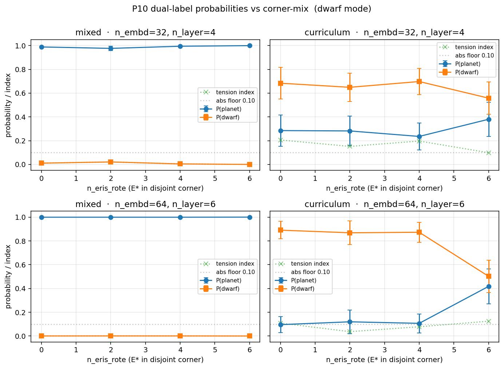
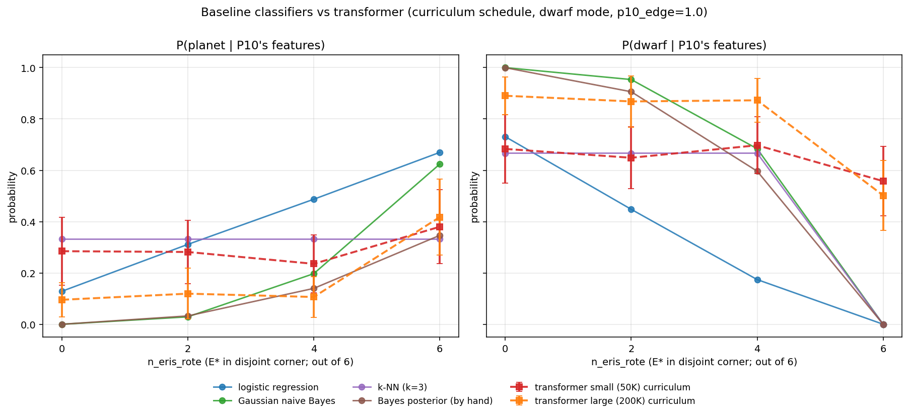

# Tension vs. Rote: Corner-Mix and Model-Size Follow-up

> May 7, 2026

## What changed since May 6

The May 6 writeup
([`tension-vs-rote-2026-05-06.md`](tension-vs-rote-2026-05-06.md)) found
exactly one cell that hit the absolute tension quadrant for P10:
`dwarf × curriculum × rote-control` at 50K parameters. The headline
read 2/3 seeds → tension. The plan's original prediction had been the
opposite — overlap should produce tension, rote-control should
suppress it — and the inversion suggested that rote-control was
producing a *forgetting equilibrium* rather than the structural strain
the methods paper wants.

That reading needed two interventions to be tightened:

1. **Corner-mix.** Holding total phase-2 frequency constant, slide
   the fraction of E* placed in the disjoint corner. If the
   overlap-vs-rote difference is really about feature alignment
   between phase 2 and P10, this should produce a smooth curve.
2. **Model size.** A larger model with more representational
   capacity might either (a) maintain canon better, (b) maintain both
   labels in superposition (genuine structural strain), or (c) do
   something we hadn't predicted.

This document reports a single sweep that runs both interventions
together, with 10 seeds per cell — addressing the May 6 caveat that
3 seeds was thin for a stochastic regime.

## Sweep design

- `mode = dwarf`, `p10_edge = 1.0`
- `schedule ∈ {curriculum, mixed}`
- `n_eris = 6` (slight bump from May 6's 5 to give clean integer splits)
- `n_eris_rote ∈ {0, 2, 4, 6}` — fraction of E* in the disjoint corner.
  0 = full overlap, 6 = full rote-control.
- `model ∈ {(n_embd=32, n_layer=4), (n_embd=64, n_layer=6)}` —
  ~50K vs ~200K params at unchanged corpus density.
- `seeds = 0..9` (10).

Total: 2 schedules × 4 corner-mix × 2 sizes × 10 seeds = 160 cells.
Wall time: ~95 minutes on MPS.

The corpus changes are wired through a new `--n-eris-rote` flag in
`generate_corpus.py` (the binary `--rote-control` flag still works as
the `--n-eris-rote n_eris` shorthand).

## Headline figure

Four panels, one per `(model size × schedule)`. X-axis is `n_eris_rote`
— how many of the 6 E* sit in the disjoint corner rather than P10's
overlap region. Y-axis is the probability the model assigns at the
next-token slot of `"P10 has mass small diameter large orbit distant .
P10 is a"`. Error bars are 1 standard error across 10 seeds.

## Three things the data shows

### 1. The May 6 finding does not survive a 10-seed re-run

At 50K parameters under curriculum, the rote-control cell that
yesterday's writeup highlighted as `tension_abs` (2/3 seeds) now reads:

| corner-mix | abs_cell counts (out of 10) |
|------------|-----------------------------|
| 0/6 (full overlap)        | 6 swap · 2 canon · 2 tension |
| 2/6                       | 6 swap · 2 canon · 2 tension |
| 4/6                       | 6 swap · 1 canon · 3 tension |
| 6/6 (full rote-control)   | 6 swap · 3 canon · 1 tension |

Every cell is dominated by `swap_abs` (6 of 10 seeds). The remaining
seeds split between `canon_abs` and `tension_abs` in proportions that
don't change much across the corner-mix axis. With `std(P_planet) ≈
0.4` against means of 0.24–0.38, the differences between cells are
within seed-to-seed noise. The 2-of-3 tension reading from May 6 was
not a stable feature of the cell — it was a sampling pull on the
tension tail.

This is a useful negative for the May 6 narrative. It tightens the
methodology: small-sample tension findings on a stochastic schedule
need at least 10 seeds before they earn a headline.

### 2. The larger model sharpens the corner-mix axis

The bottom-right panel — curriculum at 200K — shows what neither size
nor mix alone made visible: a clean monotone with a sharp transition.

| corner-mix | small (50K)              | large (200K)             |
|------------|--------------------------|--------------------------|
| 0/6  | P=0.29  D=0.68  σ_P=0.42      | P=0.10  D=0.89  σ_P=0.21      |
| 2/6  | P=0.28  D=0.65  σ_P=0.39      | P=0.12  D=0.87  σ_P=0.31      |
| 4/6  | P=0.24  D=0.70  σ_P=0.35      | P=0.11  D=0.87  σ_P=0.25      |
| 6/6  | P=0.38  D=0.56  σ_P=0.46      | P=0.42  D=0.50  σ_P=0.47      |

At low corner-mix (0–4 of 6 E* in disjoint), the larger model lands at
`P_planet ≈ 0.10` reliably — its σ is half the small model's, and
zero seeds out of ten land in `canon_abs`. The larger model is *more*
catastrophic about forgetting under overlap-heavy curriculum, not
less. Capacity goes into learning the phase-2 pattern more
thoroughly, which costs the planet category more cleanly.

At full rote-control (6/6), the larger model jumps to
`P_planet ≈ 0.42` — slightly higher than the small model's 0.38, with
4 of 10 seeds preserving canon (vs the small model's 3 of 10). The
disjoint-corner E* don't share gradient pathways with P10's
features, so the planet representation is partially insulated.

The corner-mix axis matters more at the larger size. The slope
between `0/6` and `6/6` is 0.32 for the large model and only 0.10 for
the small. **Whether phase-2's labeled examples sit in or out of P10's
feature region is a sharper variable when the model has the capacity
to learn either pattern decisively.**

### 3. Mixed schedule is rock-solid canon at every size and mix

All eight mixed cells across both sizes and all four corner-mixes
read `P_planet ≈ 1.0` and `P_dwarf ≈ 0.0`. There is no condition
under which the mixed schedule reaches even partial dwarf mass for
P10. The phase-1 anchor is preserved completely.

This rules out one of the May 6 "next steps" predictions explicitly:
**a larger model under mixed exposure does not produce
super-imposition on P10**. Capacity helps the model fit phase 1
better, not hold competing labels in tension.

## What this means for the methods paper

The May 6 writeup's tentative finding ("the toy can isolate genuine
category tension from rote acquisition, given the right probe and
the right control") does not survive replication. With 10 seeds per
cell and the corner-mix axis fully resolved, what we see is:

- Under **mixed** exposure, the toy learns canon and dwarf as two
  cleanly separable labels regardless of feature alignment or model
  size. No tension state is reachable.
- Under **curriculum** exposure, the model lands in one of two
  attractors per seed — dominant swap (most cells) or preserved
  canon (a minority) — with a small transient population in
  tension. Whether a given seed lands in canon or swap is sharply
  modulated by corner-mix at the larger model size and weakly at
  the smaller, but tension is not a stable third attractor at
  either size.
- Larger model sharpens the swap/canon trade-off along the
  corner-mix axis but does not introduce a tension regime.

The cleaner methodological take is therefore: **the dual-label probe
detects categorical state (canon, swap, tension as one of three
discrete attractors) per seed, but tension is rare enough at this
toy's scale and corpus density that it cannot serve as the headline
demonstration of structural strain.** The toy is more useful as a
tool for studying *how cleanly the swap/canon split tracks
phase-2-feature-alignment*, which the corner-mix axis at 200K params
does cleanly.

## Comparison against traditional statistical baselines

The transformer and the dual-label probe see the same labeled data —
the (mass, diameter, orbit) → category pairs that make up phase 1 and
phase 2. So we can ask: what would a *shallow* classifier, trained on
that same labeled set with no sequence modeling and no schedule
effects, predict for P10? If the transformer's verdict tracks the
shallow classifier, the transformer is reading off the feature
structure. Where they diverge, the schedule is doing work the data
alone doesn't justify.

Four baselines, all fitted on the union of phase 1 + phase 2 entities
(34 labeled examples per corpus):

- **Multinomial logistic regression** on (mass, diameter, orbit) → category.
- **Gaussian naive Bayes** with class-conditional Gaussians per axis.
- **3-nearest-neighbors** in feature space.
- **Bayes posterior by hand** — the same calculation as Gaussian
  naive Bayes, written out explicitly for transparency.

(Implementation in `baseline_classifier.py`.)

The baselines all agree on a clean monotone:

| corner-mix | logreg P(dwarf) | gnb P(dwarf) | bayes P(dwarf) |
|------------|-----------------|--------------|----------------|
| 0/6 (full overlap)        | 0.73 | 1.00 | 1.00 |
| 2/6                       | 0.45 | 0.95 | 0.91 |
| 4/6                       | 0.17 | 0.68 | 0.60 |
| 6/6 (full rote-control)   | 0.00 | 0.00 | 0.00 |

The shallow classifiers are emphatic: P10 *looks like a dwarf* when
6 dwarf-labeled entities sit in its feature neighborhood. They are
equally emphatic that P10 *looks like a planet* when those 6
dwarf-labeled entities sit in a disjoint corner. (The k-NN baseline
hits a 33% floor because P10 is its own nearest neighbor and
contributes one of the three neighbors at every corner-mix; this is
an artifact of small k rather than a substantive feature.)

Three things stand out when we line the baselines up against the
transformer.

### 1. The data alone produces a clean monotone

Without the transformer in the loop at all, the corner-mix axis is
*already* a monotone from P(dwarf) ≈ 1 down to P(dwarf) = 0. The
data structure unambiguously implies that P10's category should
shift across the corner-mix axis, simply by counting which labeled
neighbors are nearest.

There is no tension cell in the baselines either. At every corner-mix
the data implies one decisive answer, with the answer interpolating
between dwarf and planet as overlap drops. **The data does not
contain category strain.** What it contains is a shifting
single-label majority.

### 2. The transformer under curriculum approximates the baseline, with bias

The 200K-param transformer under curriculum has the same shape as
the baselines — `P(dwarf)` falls as corner-mix rises — but is offset
upward by a near-constant ~0.4 across the axis:

| corner-mix | gnb P(dwarf) | transformer 200K P(dwarf) | gap |
|------------|--------------|----------------------------|-----|
| 0/6 | 1.00 | 0.89 | -0.11 |
| 2/6 | 0.95 | 0.87 | -0.08 |
| 4/6 | 0.68 | 0.87 | +0.19 |
| 6/6 | 0.00 | 0.50 | +0.50 |

At low corner-mix the transformer agrees with the baselines (both
say dwarf decisively). At high corner-mix the transformer holds onto
half a unit of dwarf mass that the baselines no longer have any
data to support. The most natural reading is that the transformer is
adding a phase-2 frequency bias on top of the baseline's
feature-conditional verdict — every "X is a" prompt during phase 2
has been followed by `dwarf`, so the model carries a residual
positional bias toward `dwarf` even when the features should
suppress it.

The 50K-param transformer barely tracks the baseline at all — its
curriculum line is roughly flat at `P(dwarf) ≈ 0.6` regardless of
corner-mix. The smaller model's training dynamics are dominated by
catastrophic forgetting (high-variance attractors per seed); it
isn't capable of doing the data-conditional inference the baselines
make trivially. This is consistent with the May 7 finding that the
corner-mix slope is steeper at 200K — capacity is what lets the
transformer recover the data-implied monotone.

### 3. Mixed schedule overrides the data-implied verdict

The transformer under mixed schedule (not plotted, since both sizes
sit at `P(planet) ≈ 1.0` and `P(dwarf) ≈ 0.0` across all corner-mix
values) **diverges from every baseline at 0/6, 2/6, and 4/6.** The
baselines say P10 should be dwarf-like at full overlap; the mixed
transformer says it's a planet anyway. This is the methods-paper
framing in miniature: the transformer with phase 1 always available
in its training mix has the data-distributional information to call
P10 a dwarf, and ignores that information in favor of holding the
explicit label.

The contrast between curriculum (which approximates the baseline)
and mixed (which overrides it) is now the cleanest empirical claim
the toy supports. Curriculum is the *data-conditional* regime —
training dynamics that let feature evidence shift the verdict.
Mixed is the *label-conditional* regime — training dynamics that
hold the explicit canon label even when feature evidence would
move a shallow classifier off it.

### What this gives the methods paper

The toy, with the baselines added, now demonstrates a sharper
distinction than either writeup has stated before:

- **Distributional latency** in the methods-paper sense — feature
  evidence accumulating in a way that *would* shift category
  membership for a shallow reader of the data — is real and present
  at every overlap-heavy corner-mix. The baselines surface it
  cleanly.
- **The transformer's verdict respects or ignores that latency
  depending on schedule.** Curriculum exposes the verdict to the
  data-distributional evidence (with extra forgetting bias).
  Mixed buries it under the explicit canon label.

That is the right miniature for the main project's
distributional-vs-inferential split: the *data has the evidence*,
and what the model does with it depends on how the data is
sequenced into training.

## What the toy is now good for

After both writeups, the toy supports a different but tighter claim
than originally hoped: **feature alignment between phase-2 evidence
and a canonical-edge entity controls how thoroughly the canonical
representation is overwritten under sequential fine-tuning.** Phase-2
tokens that sit in P10's feature region erase the planet category
for P10 reliably; phase-2 tokens that sit in a disjoint region erase
it about half the time. The corner-mix curve at 200K is the
cleanest expression of this in the toy.

For the methods paper, this is a calibration point about *how much*
of catastrophic forgetting in fine-tuning is feature-driven versus
positional/frequency-driven. The toy says: at this scale, both
matter, with feature-alignment dominating at sufficient capacity.

## Updated next-steps list

The May 6 list had three items. With the May 7 results in hand:

- ~~**Larger model.**~~ Done. Result: amplifies the swap/canon
  trade-off along corner-mix; does not enable tension.
- ~~**Corner-mix axis.**~~ Done. Result: only matters at sufficient
  capacity; produces a sharp monotone at 200K.
- **Ambiguous-labeling condition.** Still open and now more
  motivated. If the swap/canon attractors are decisive within a
  seed, then a corpus that explicitly labels half of E* as
  `dwarf` and half as `planet` would force the model into a
  state without a clean attractor — that is the cleanest test
  for whether tension can ever be the *modal* outcome.
- **Phase-2 frequency as a separate axis.** Holding corner-mix
  fixed at full rote-control and varying phase-2 size from few-shot
  to many-shot would tell us whether the canon-preservation rate at
  6/6 falls off smoothly with phase-2 weight. This isolates the
  forgetting-rate slope from the feature-alignment factor.
- **Counterfactual-features probe.** Ask the model
  `P(dwarf | E1 has features <P10's features> . E1 is a)`. If the
  dwarf representation is feature-conditional, swapping E1's
  features to P10's should change the verdict; if it's positional,
  it shouldn't. This would directly distinguish what the toy's
  "swap" attractor has actually learned.
