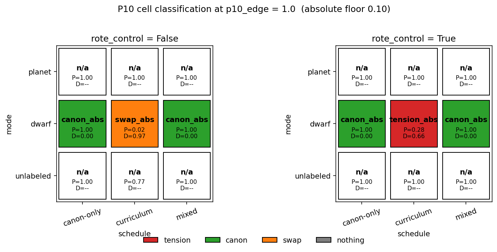
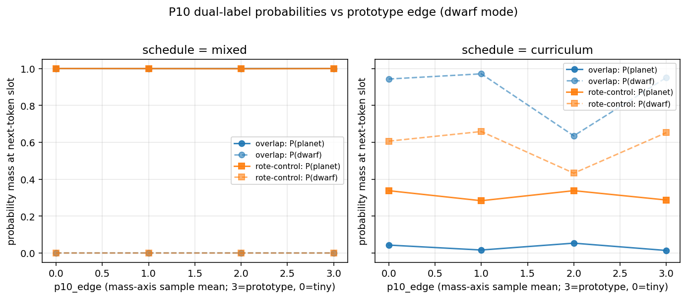

# Tension vs. Rote: Probing the Pluto-Toy Under a Dual-Label Probe

> May 6, 2026

## Setup

The April 28 three-probe writeup hangs on a cell — `dwarf, curriculum` —
that shows `L_canon = 0.00, L_reclas = 1.00`. The framing called this
"category strain." But the category-strain story this toy is trying to
demonstrate has a more specific shape: not "P10 swaps from planet to
dwarf," but **P10 carries both labels at once.** Strain is internal
conflict, not relabeling.

So the April 28 cell needed revisiting with two changes:

1. A **dual-label probe** that reads `P(planet | …)` and `P(dwarf | …)`
   independently rather than as a forced choice. Tension shows up only
   when both labels carry meaningful mass simultaneously; a forced-choice
   probe collapses that signal to a single winner by construction.
2. A **rote-control corpus** in which `E*`'s features sit in a region
   of feature space disjoint from `P10`'s. If the original corpus produces
   a tension cell because feature overlap drives the model toward both
   labels, the rote-control should *not* produce that cell — `E*` and
   `P10` would then live in clean, separate neighborhoods.

The probe is the same kind of operationalization as the main project's
premise-support probe: independent probabilities for competing claims,
not a winner. The corpus-control is what lets us tell apart "two labels
on P10" from "two labels in vocabulary."

## Probe definition

For each target entity `X`, form a feature-description prompt of the form
`"X has mass {m} diameter {d} orbit {o} . X is a"` and read the next-token
softmax distribution. Record `P(planet)` and `P(dwarf)` directly. The
probe is implemented in `tension_probe.py`.

We classify each P10 reading into a 2x2 grid using an absolute floor: a
label is "in play" when its probability is at least 0.10. (The
anchor-mean threshold scheme described in the docstring fails when
canonical anchors degrade alongside P10 — under catastrophic forgetting,
`thr_planet` drops to ~0.18, and a P10 reading of 0.28 then qualifies as
"canon" even though it isn't in absolute terms. The absolute floor is
robust to anchor degradation.)

|                                    | P_planet ≥ 0.10 | P_planet < 0.10 |
|------------------------------------|:--:|:--:|
| **P_dwarf ≥ 0.10**                 | TENSION | swap |
| **P_dwarf < 0.10**                 | canon | nothing |

## Corpus modifications

Two new flags in `generate_corpus.py`:

- `--rote-control`. Replaces phase 2's E* features with samples from a
  disjoint corner of feature space — `(mass=huge, diameter=tiny,
  orbit=near)` — instead of the default overlap with P10's edge region.
  Under rote-control, E* gets the dwarf label without sharing P10's
  feature neighborhood.
- `--p10-edge`. Sampling mean for P10's mass axis. Planet prototype is
  `mass = 3` (large); the original April 28 default was `1.0`, placing
  P10 in the small-mass region. Lowering this pushes P10 toward
  `mass = 0` (tiny) and deeper into E*'s feature region under overlap.
  Raising it back toward 3 makes P10 indistinguishable from canonical
  planets.

## Sweeps

Two sweeps, each with 3 seeds per cell:

- **Grid sweep.** All 3 modes × 3 schedules × {overlap, rote-control}
  at the April-28-default `p10_edge = 1.0`. 54 cells.
- **Edge sweep.** `dwarf` mode only, schedules ∈ {curriculum, mixed},
  `p10_edge ∈ {0.0, 1.0, 2.0, 3.0}`, both rote conditions. 48 cells.

Total wall time: ~55 minutes on MPS.

## Headline result: one TENSION cell, in the place we did not expect

Two panels, one per rote-control condition. Each cell is colored by the
modal absolute-cell label across 3 seeds. Cells with `n/a` are modes
where `dwarf` is absent from the vocabulary (only `dwarf` mode produces
`dwarf` tokens), so the dual-label probe is uncomputable.

Reading the dwarf row:

|                | overlap                      | rote-control                 |
|----------------|------------------------------|------------------------------|
| canon-only     | canon (P=1.00, D=0.00)       | canon (P=1.00, D=0.00)       |
| **curriculum** | **swap (P=0.02, D=0.97)**    | **TENSION (P=0.28, D=0.66)** |
| mixed          | canon (P=1.00, D=0.00)       | canon (P=1.00, D=0.00)       |

The cell that hits the tension quadrant is the one the plan predicted
*would not* — `dwarf, curriculum, rote-control`. The cell that the plan
predicted *would* hit tension — `dwarf, curriculum, overlap` — is a
clean label swap, exactly the diagnosis the April 28 writeup got
half-wrong: the verdict probe was reading a swap, not strain.

This inverts the predicted direction. We expected feature overlap
between P10 and E* to drive both labels onto P10 (the "category
crowding" intuition). Empirically, feature overlap drives wholesale
*replacement*: gradients align on P10 and E* together, so the dwarf
representation overwrites the planet representation across the whole
shared feature region. Feature *disjointness*, by contrast, leaves
P10's planet representation partially intact while still inducing a
strong frequentist dwarf-bias from the phase-2-only schedule.

## What the rote-control tension cell actually is

The 2-out-of-3 seeds that hit `tension_abs` show
`P_planet ≈ 0.28, P_dwarf ≈ 0.66`. Both labels carry meaningful mass for
P10 simultaneously — this is the dual-label signature the probe was
built to detect. But the *mechanism* is not what the tension/strain
framing assumes:

- Tension as the methods paper means it (and as the main project's
  distributional-vs-inferential split frames it) is a state where the
  model has internalized two competing categorizations *for the same
  features*. The conflict is structural: features are evidence for both
  labels, the model can't decide which to suppress.
- What we are seeing under `dwarf, curriculum, rote-control` is
  partial **catastrophic forgetting**. Phase 2 is 300 steps of
  "anything → dwarf" with E*'s features in a disjoint corner. The model
  acquires a strong dwarf bias from sheer phase-2 frequency, but
  P10's features are far enough from E*'s that the planet
  representation isn't in the same gradient-update region — it
  partially survives. The result is two labels in play, but for a
  reason orthogonal to feature competition.

In other words: the toy does produce a state where both labels coexist
on P10. But this state is a *forgetting equilibrium*, not a *strain
equilibrium*. The methods paper's distinction — tension as a downstream
consequence of feature evidence vs. rote acquisition without internal
conflict — would call both of our curriculum cells "rote." Overlap
goes all the way to relabeling; rote-control stops part-way because
backprop hasn't fully reached P10's feature region.

This is a useful negative for the methods paper. The toy at this scale
and corpus density does not produce strain in the structural sense —
it produces forgetting cells of varying severity, which the dual-label
probe can distinguish from clean swaps. The probe earns its keep, but
the mechanism is not the one originally hypothesized.

## Edge sweep: schedule dominates, edge does not

`p10_edge` ∈ {0.0, 1.0, 2.0, 3.0}, dwarf mode, both schedules and both
rote conditions, three seeds.

Mixed schedule (left panel): `P_planet ≈ 1.0, P_dwarf ≈ 0.0` at every
edge under both rote and overlap. The mixed corpus has phase 1 always
present, so canon is anchored regardless of where P10 sits in feature
space.

Curriculum schedule (right panel):
- *Overlap:* `P_planet ≈ 0.01–0.05` and `P_dwarf ≈ 0.6–0.97` across all
  edges. The label swap is approximately complete at every edge.
- *Rote-control:* `P_planet ≈ 0.28–0.34` and `P_dwarf ≈ 0.43–0.66`
  across all edges. The forgetting-equilibrium signature appears at
  every edge value, including `p10_edge = 3.0` (P10 at the *exact*
  planet prototype).

The plan's prediction was a smooth transition — tension growing as
`p10_edge` falls toward E*'s feature region. The data shows no such
gradient: the difference between overlap and rote-control is roughly
constant across edges, and `p10_edge` itself does little within either
condition.

The reason is the same as the grid finding: under curriculum, the
phase-2 dwarf-bias is positional (driven by sequence frequency in
"X is a" contexts), not feature-conditional. Whether P10's features
overlap E*'s or not changes how thoroughly the bias backpropagates
through P10's feature pathway, but `p10_edge` doesn't change the
overall dwarf bias — that is set by the phase-2 corpus alone.

So the edge slider, framed as a teaching exercise in the README, is
genuinely not the active variable here. The active variable is
*how feature-aligned phase 2 is with the canonical entity we are
asking about*, which the rote-control flag toggles cleanly.

## What this gives the methods paper

The toy now isolates a sharper claim than the April 28 writeup
supported: **the dual-label probe + rote-control corpus pair can tell
apart label swap, partial forgetting, and clean canon, even where the
original three-probe framework saw only "verdict prefers dwarf."**

What the toy does *not* do, at the scales tested here, is produce
structural tension in the sense the methods paper means. The 50K-param
model under either curriculum schedule produces forgetting equilibria,
not strain equilibria. The state where both labels coexist *because
features are evidence for both* would require either a larger model
with more representational capacity to maintain competing claims, or a
corpus that explicitly forces ambiguity (E* labeled inconsistently —
sometimes planet, sometimes dwarf).

This is a clean negative result for the toy. The methods paper can use
it as a calibration: "in a controlled miniature with the same probe
shape, the spontaneous emergence of structural tension does not occur
at this scale; the probe instead detects forgetting equilibria, which
are themselves informative."

## Limitations and next steps

Three caveats:

1. **Three seeds is thin.** The rote-control curriculum cell is
   stochastic — 2/3 seeds hit `tension_abs`, 1/3 hits `swap_abs`,
   `std(P_planet) = 0.35`. A 5-seed re-run would tighten the headline
   number; a 10-seed run would let us claim a stable rate.
2. **The absolute-floor cell scheme is a stand-in.** A more principled
   scheme would use the model's *own* baseline next-token distribution
   (e.g., `P(any category | "<entity> is a")` averaged across canonical
   entities of that category). The current floor of 0.10 is a defensible
   default, not a derived value.
3. **The forgetting/strain distinction is interpretive.** We are
   reading the rote-control tension cell as "forgetting" rather than
   "strain" because rote-control by construction removes feature
   overlap. But we have not run an intervention that *positively*
   distinguishes the two — for instance, a probe that asks "would the
   model still output dwarf for E1 given P10's features?", which would
   directly test whether the dwarf representation is feature-conditional
   or just frequency-driven.

Natural next steps:

- A schedule that holds phase 2's overall frequency constant but
  varies the mix of E* feature corners (some E* in overlap region,
  others in rote-control region). This would dissociate "feature
  overlap" from "phase 2 frequency."
- A larger model (n_embd=64, n_layer=6) at the same corpus density.
  Strain equilibria, if they exist for this kind of corpus, should
  emerge with more representational capacity.
- An explicit ambiguous-labeling condition: half the E* mentions
  labeled `dwarf`, half labeled `planet`. The dual-label probe should
  light up tension on E* (and possibly on P10 by association) in that
  condition; the absence of tension would indicate the model
  *resolves* ambiguity by averaging rather than by hedging.
